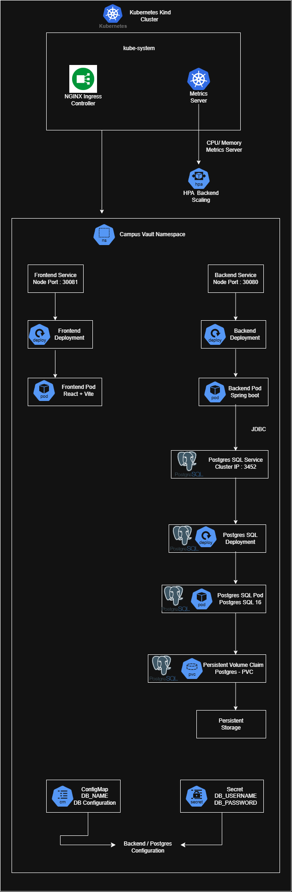
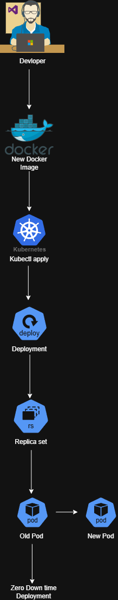
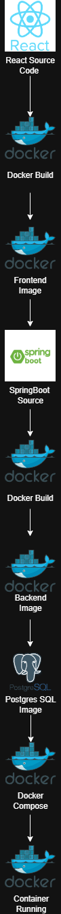

# CampusVault — Cloud & DevOps Deployment

## Overview

CampusVault is a full-stack academic notes management platform deployed using containerization, Kubernetes orchestration, and AWS cloud infrastructure.

The primary focus of this project was to gain practical experience with:

* Docker containerization
* Kubernetes orchestration
* Amazon EKS
* Amazon ECR
* Kubernetes Services
* Kubernetes Ingress
* AWS Application Load Balancer
* AWS IAM
* AWS VPC networking
* Persistent storage
* Cloud-based application deployment

The application was successfully deployed to an AWS Kubernetes environment and accessed through an AWS Application Load Balancer.

---

## Cloud Architecture

```text
                         Internet / User
                                │
                                ▼
                    ┌─────────────────────┐
                    │ AWS Application     │
                    │ Load Balancer       │
                    └──────────┬──────────┘
                               │
                               ▼
                    ┌─────────────────────┐
                    │ Kubernetes Ingress  │
                    │ AWS Load Balancer   │
                    │ Controller           │
                    └──────────┬──────────┘
                               │
                 ┌─────────────┴─────────────┐
                 │                           │
                 ▼                           ▼
        ┌─────────────────┐        ┌─────────────────┐
        │ Frontend        │        │ Backend         │
        │ React + Nginx   │        │ Spring Boot     │
        │ Kubernetes Pod  │        │ Kubernetes Pod  │
        └─────────────────┘        └────────┬────────┘
                                            │
                                            ▼
                                   ┌─────────────────┐
                                   │ PostgreSQL      │
                                   │ Kubernetes Pod  │
                                   │ Persistent Vol. │
                                   └─────────────────┘

              AWS EKS
                 │
        ┌────────┴─────────┐
        │                  │
   Kubernetes         Amazon ECR
   Cluster            Container Images
```

---

# Docker

Docker was used to package the application components into portable containers.

### Frontend Container

The React frontend is built into static files and served through Nginx.

```text
React/Vite
    ↓
npm build
    ↓
Docker Image
    ↓
Nginx
```

### Backend Container

The Spring Boot backend is packaged into a Docker image and deployed as a Kubernetes workload.

```text
Spring Boot
    ↓
Maven Build
    ↓
Docker Image
    ↓
Kubernetes Pod
```

Containerization provides consistent application environments and allows the same images to be deployed locally or in the cloud.

---

# Amazon ECR

Amazon Elastic Container Registry (ECR) was used as the private container registry for the CampusVault Docker images.

The deployment workflow was:

```text
Application Source Code
        ↓
Docker Build
        ↓
Docker Image
        ↓
Amazon ECR
        ↓
Amazon EKS
        ↓
Kubernetes Pods
```

Separate container images were used for the frontend and backend.

Example:

```text
campusvault-frontend:latest
campusvault-backend:latest
```

---

# Amazon EKS

Amazon Elastic Kubernetes Service (EKS) was used to run the Kubernetes cluster in AWS.

The EKS environment provided the infrastructure required to run the containerized CampusVault application.

The Kubernetes cluster contained workloads for:

* Frontend
* Backend
* PostgreSQL

Kubernetes was responsible for:

* Pod management
* Container scheduling
* Service discovery
* Application networking
* Workload deployment
* Restarting failed containers
* Persistent storage configuration

---

# Kubernetes Architecture

The application was separated into Kubernetes resources.

### Deployments

```text
frontend-deployment.yaml
backend-deployment.yaml
postgres-deployment.yaml
```

Deployments define how the application containers should run inside the cluster.

### Services

The application used Kubernetes Services for internal and external networking.

```text
Frontend Service
Backend Service
PostgreSQL Service
```

The PostgreSQL service remained internal to the Kubernetes cluster.

---

# Kubernetes Ingress

Kubernetes Ingress was used to expose the application through AWS networking.

The project used the AWS Load Balancer Controller to provision an AWS Application Load Balancer from the Kubernetes Ingress configuration.

The flow was:

```text
User
  ↓
AWS Application Load Balancer
  ↓
Kubernetes Ingress
  ↓
Kubernetes Service
  ↓
Application Pod
```

This demonstrates how Kubernetes networking can integrate with AWS cloud infrastructure.

---

# AWS Application Load Balancer

The AWS Application Load Balancer provided the public entry point for the deployed CampusVault application.

Instead of directly exposing individual Kubernetes pods, traffic was routed through the load balancer and Kubernetes networking layer.

This provided a cleaner cloud architecture:

```text
Internet
   ↓
AWS ALB
   ↓
Ingress
   ↓
Kubernetes Services
   ↓
Pods
```

---

# AWS VPC

The EKS environment operated inside an AWS VPC.

The VPC provides the underlying network environment for the AWS resources used by the Kubernetes cluster.

The deployment involved AWS networking concepts such as:

* VPC
* Subnets
* Security groups
* Route tables
* Internet connectivity
* EKS networking

---

# AWS IAM

AWS IAM was used to provide permissions required by AWS components.

IAM policies were configured for AWS services involved in the Kubernetes deployment, including permissions required by the AWS Load Balancer Controller.

The project also used IAM-based access for interaction with AWS services such as ECR and EKS.

No AWS access keys or credentials are stored in this repository.

---

# Persistent Storage

PostgreSQL was deployed inside the Kubernetes environment with persistent storage configuration.

The project used:

```text
PostgreSQL
    ↓
PersistentVolumeClaim
    ↓
Persistent Storage
```

The purpose of persistent storage is to prevent database data from depending solely on the lifecycle of an individual PostgreSQL container.

---

# Kubernetes Deployment Workflow

The overall deployment process was:

```text
1. Develop Application
        ↓
2. Build Frontend & Backend
        ↓
3. Create Docker Images
        ↓
4. Authenticate with AWS
        ↓
5. Push Images to Amazon ECR
        ↓
6. Deploy Kubernetes Resources
        ↓
7. Run Workloads on Amazon EKS
        ↓
8. Configure Kubernetes Services
        ↓
9. Configure Ingress
        ↓
10. AWS Load Balancer Controller
        ↓
11. AWS Application Load Balancer
        ↓
12. Access Application
```

---

# Useful Kubernetes Commands

Some of the commands used during deployment and troubleshooting:

### View pods

```bash
kubectl get pods -n campusvault
```

### View services

```bash
kubectl get service -n campusvault
```

### View ingress

```bash
kubectl get ingress -n campusvault
```

### View deployments

```bash
kubectl get deployments -n campusvault
```

### Check the deployed frontend image

```bash
kubectl get deployment frontend -n campusvault \
-o jsonpath="{.spec.template.spec.containers[0].image}"
```

### Inspect frontend pods

```bash
kubectl get pods -n campusvault -l app=frontend -o wide
```

### Inspect resources across namespaces

```bash
kubectl get svc -A
```

---

# Cloud Deployment Challenges

During the deployment several practical issues were encountered and resolved.

### AWS Authentication

AWS CLI credentials initially produced invalid-token errors.

The AWS CLI configuration was corrected and AWS identity verification was performed using:

```bash
aws sts get-caller-identity
```

This demonstrated the importance of validating AWS authentication before interacting with ECR or EKS.

---

### Amazon ECR Authentication

Docker initially returned:

```text
403 Forbidden
```

when pushing the image to ECR.

The issue was traced to AWS authentication rather than the Docker image itself.

After correcting the AWS credentials, ECR authentication and image pushing could proceed.

---

### Kubernetes Connectivity

At one point Kubernetes returned:

```text
TLS handshake timeout
```

when communicating with the EKS cluster.

This highlighted the dependency between the local Kubernetes client configuration and the availability/connectivity of the AWS EKS control plane.

---

### Frontend Deployment Debugging

The deployed frontend initially displayed unexpected or blank content.

The issue was investigated by checking:

* Kubernetes deployment image
* Running frontend pod
* Nginx static files
* JavaScript bundle
* HTTP responses from the AWS Load Balancer
* Browser/application routing

Commands such as `kubectl exec`, `curl`, and Kubernetes resource inspection were used to trace the problem from the browser back to the deployed container.

---

# Security Considerations

Sensitive configuration should not be committed to source control.

The project uses:

```text
k8s/secret.example.yaml
```

as a template rather than storing actual credentials in GitHub.

Actual Kubernetes secrets should be supplied separately during deployment.

AWS credentials are also not stored in the repository.

---

# Key Cloud Skills Demonstrated

This project demonstrates practical experience with:

* AWS cloud infrastructure
* Amazon EKS
* Amazon ECR
* Docker
* Kubernetes
* Kubernetes Deployments
* Kubernetes Services
* Kubernetes Ingress
* AWS Load Balancer Controller
* AWS Application Load Balancer
* AWS IAM
* AWS VPC
* Persistent storage
* Cloud troubleshooting
* Container deployment
* Kubernetes networking
* AWS CLI
* Git/GitHub

---

# Project Outcome

CampusVault was successfully containerized and deployed using Docker and Kubernetes on AWS.

The deployment demonstrates the complete path from application source code to a cloud-accessible application:

```text
Source Code
    ↓
Docker
    ↓
Amazon ECR
    ↓
Amazon EKS
    ↓
Kubernetes
    ↓
Ingress
    ↓
AWS Application Load Balancer
    ↓
Internet
```

The project was developed as a portfolio project to demonstrate practical Full Stack, Cloud, Docker, Kubernetes, and AWS skills.

---

# Screenshots

## 1. Overall Architecture / Application Flow


Shows the overall flow and architecture of the CampusVault application.

---

## 2. Kubernetes Architecture



Shows the Kubernetes architecture and deployment structure used for CampusVault.

---

## 3. Kubernetes Rolling Update



Demonstrates the Kubernetes rolling update deployment strategy used to update application versions without directly stopping the running workload.

---

## 4. Kubernetes Rollback



Demonstrates Kubernetes rollback functionality for reverting a deployment to a previous stable version.

---

# Repository Structure

```text
CampusVault/
│
├── backend/
│   └── Spring Boot Application
│
├── frontend/
│   └── React Application
│
├── k8s/
│   ├── backend-deployment.yaml
│   ├── frontend-deployment.yaml
│   ├── postgres-deployment.yaml
│   ├── postgres-pvc.yaml
│   ├── ingress.yaml
│   ├── secret.example.yaml
│   └── aws-load-balancer-controller-trust-policy.json
│
├── iam_policy.json
├── .gitignore
└── README.md
```

---

## Conclusion

CampusVault provided practical experience in taking a full-stack application from local development to a containerized Kubernetes deployment running on AWS.

The project particularly focused on understanding how Docker, Kubernetes, Amazon ECR, Amazon EKS, IAM, VPC networking, Ingress, and AWS Load Balancing work together to deliver a cloud-hosted application.
